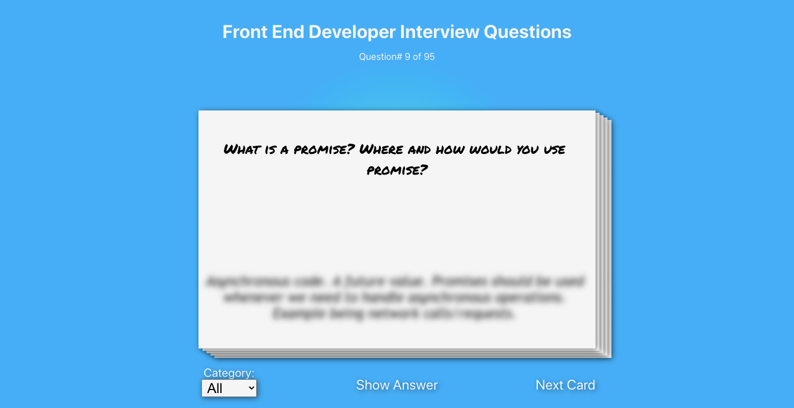

# Front-End Developer flash cards



Flash cards with many front-end develope interview questions. The questions are stored in Firebase firestore database.

[VIEW](https://front-end-dev-flash-cards.web.app) (hosted with Firebase hosting)

## Setup

To use/clone this repo as is you will have to provide your own Firebase firestore information.

Simply create an ```.env``` file with the following variables, and fill with config from firebase.

```javascript
REACT_APP_API_KEY=
REACT_APP_AUTH_DOMAIN=
REACT_APP_DATABASE_URL=
REACT_APP_PROJECT_ID=
REACT_APP_STORAGE_BUCKET=
REACT_APP_MESSAGING_SENDER_ID=
```

## Installation

```bash
yarn install
```

or

```bash
npm install
```

## License

[MIT](https://choosealicense.com/license/mit/)